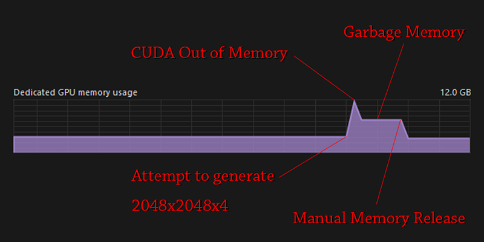

# SD Webui Memory Release
This is an Extension for the [Automatic1111 Webui](https://github.com/AUTOMATIC1111/stable-diffusion-webui), which *attempts to* clean up memory after each generation.

### But Why?
- A few Reddit posts/comments mentioned that CUDA sometimes can cause memory issues/leaks. 
This Extension *tries to* solve that by calling `torch.cuda.empty_cache()` after each generation.

### Features
- Perform `gc.collect()` and `torch.cuda.empty_cache()` after every generation
- A button to manually trigger the above
- A button to unload then reload the checkpoint
    - (This is just the same built-in functions in the **Actions** section of the **Settings** tab)

### Experimental
You can optionally go to the `System` section of **Settings** tab to enable `Unload Checkpoint after Generation`.
This mimics how **ComfyUI** works: Only keeping the Checkpoint in memory during generation. 
This achieves the maxinum memory cleanse; but the reloading may take a while depending on your system specs.

[1] Shout out to [@kgmkm_mkgm](https://twitter.com/kgmkm_mkgm/status/1658760768958140418) for sharing this Extension with tens of thousands of people 

[2] Apparently, this indeed does help in [certain situations](https://github.com/Haoming02/sd-webui-memory-release/issues/3) 
